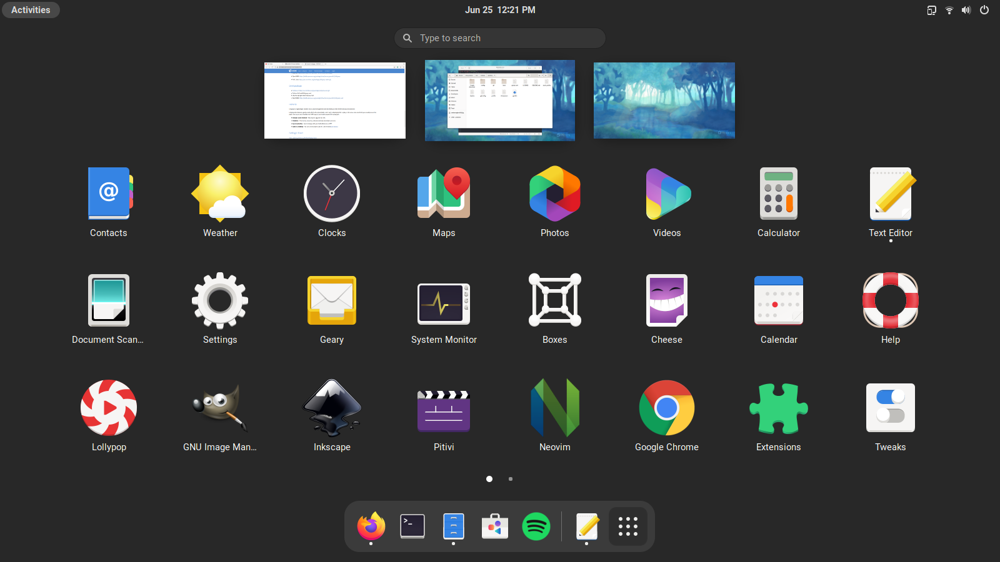

    <b>Dotfiles</b>
     
    <i>My regularly updated dotfiles for Linux</i>
     
     
    

## Software

- OS: [Fedora](https://getfedora.org/)
- Desktop: [GNOME](https://www.gnome.org/)
- Terminal: [Alacritty](https://github.com/alacritty/alacritty)
- Shell: [zsh](https://www.zsh.org/)
- Editor: [Neovim](https://neovim.io/)
- File Manager: [Nautilus](https://gitlab.gnome.org/GNOME/nautilus)
- Music player: [Lollypop](https://wiki.gnome.org/Apps/Lollypop)

## State of configuration

### Working

- Alacritty
- Bash
- Legendary
- Neovim
- Rofi
- Zsh
